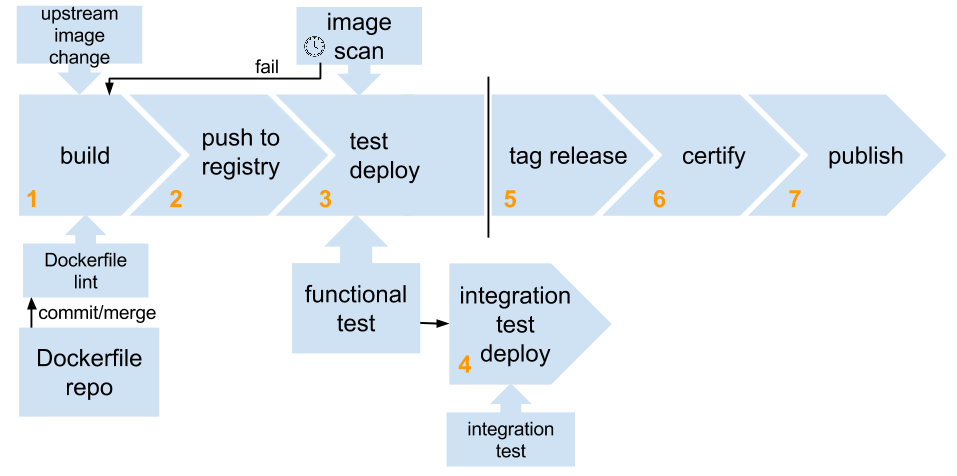

# OpenShift Image Build Pipeline

A container image automated build pipline based on OpenShift V3 and Jenkins to build, deploy, test, promote, certify and publish



1. A new build may be triggered by a source control change, a failed image scan, an upstream (FROM) image change or manually. A Dockerfile lint test is run before the build begins and may optionally gate the build.
1. New image is pushed to internal OpenShift registry. Image tagged with incremented build number.
1. Image is deployed for testing. Single-image functional testing is performed. Deployment is scanned periodically for vulnerabilities. If scan fails a new build is triggered.
1. An optional integration test phase of dependent images or services. Integration deployment may be a vm-based platform such as Atomic Enterprise.
1. Automation is gated on manual tagging for release. The tag release job triggers certification and publication.
1. Submit for certification.
1. Publish to public registry. Image is available pull using new release tag.

## Local Development setup

We're using OpenShift all-in-one container deployment method. See [Getting Started](https://github.com/openshift/origin/#getting-started) instructions.

1. Run OpenShift all-in-one as a container

        docker run -d --name origin --privileged --net=host \
            -v /:/rootfs:ro -v /var/run:/var/run:rw \
            -v /sys:/sys:ro -v /var/lib/docker:/var/lib/docker:rw \
            -v /var/lib/openshift/openshift.local.volumes:/var/lib/openshift/openshift.local.volumes openshift/origin start

1. Enter the container to use the OpenShift CLI.

        $ sudo docker exec -it origin bash

1. Create a registry

        $ oadm registry --credentials=./openshift.local.config/master/openshift-registry.kubeconfig

## Using OpenShift

1. Login using default credentials.

        $ oc login
        Username: test
        Password: test

1. Create a project

        $ oc new-project test

1. Add the `edit` role to the `default` service account in the `test` project. This is so Jenkins can access the OpenShift environment using a service account token.

        $ oc policy add-role-to-user edit system:serviceaccount:test:default

1. Upload the OpenShift template. This will make the template available to instantiate.

        oc create -n test -f https://raw.githubusercontent.com/aweiteka/ose-build-pipeline/master/ose-build-template.yaml

 In the [OpenShift web interface](https://<host_ip_address>:8443) create a new instance of the template you uploaded.

1. Login with credentials test/test
1. Select "test" project
1. Select "Add to Project", "Browse all templates..." and select the "automated-builds" template.
1. Select "Edit Parameters", edit the form and select "Create".

This creates a whole pile of resources: image streams, test deployment, a Jenkin master and the appropriate services and routes to access these resources.

When the Jenkins master is deployed we need to get the service IP address and port.

* OpenShift web UI: navigate to Browse, Services
* CLI: `oc get service jenkins`

**Note**: If you are not on the same host you'll need to [deploy and configure a router](https://docs.openshift.org/latest/admin_guide/install/deploy_router.html).


## Jenkins setup

Now we're ready to create jobs in the Jenkins master. We'll use Jenkins Job builder to define the jobs then render them using a CLI tool.

1. Copy the Jenkins Job Builder template and config directory to your source repository and edit. The directory should look something like this.

        ├── config
        │   └── jenkins-jobs.ini
        ├── Dockerfile
        ├── ...
        └── jenkins-jobs.yaml

1. Edit the jenkins-jobs config file `config/jenkins-jobs.ini` changing the jenkins master service IP address.
1. Run the Jenkins Job Builder tool to upload jobs to the Jenkins master. Run the container from the same directory of the `jenkins-jobs.yaml` file.

        sudo atomic run aweiteka/jenkins-job-builder

1. Each time you want to make a change to a job, run this tool again to update the changes in the Jenkins master.
1. Using a browser load the Jenkins web UI using the Jenkins service IP address and port. Default credentials are admin/password if you did not change them during the template deployment.


## Notes

* Upload template for all OpenShift users. As OpenShift admin upload template for all users and projects.

        oc create -f ose-build-template.json -n openshift

* Use OpenShift CLI to create application based on template

        oc process -f ose-build-template.json -v SOURCE_URI=https://github.com/aweiteka/test-isv-auth.git,BASE_DOCKER_IMAGE=centos,BASE_DOCKER_IMAGE_TAG=centos7,BUILD_IMAGE_NAME=acmeapp,NAME=acme,TEST_CMD='/usr/bin/sleep 10' | oc create -f -


* Delete resources in bulk

        oc delete all -l template=automated-build

* Trigger OpenShift web hook remotely

        curl -X POST <openshift_webhook_url> [--insecure]

* after test promote image with new tag (from jenkins?)

        oc tag ${BUILD_IMAGE_NAME}:${BUILD_IMAGE_TAG} ${BUILD_IMAGE_NAME}:<new-tag>

* export local OSE resources as template

        oc export all --all -o json --as-template myproject > myproject.json

* import on another openshift server

        oc new-app -f myproject.json

* Image scanning. Assumes image contents in `/tmp/image-content`

        export OSCAP_PROBE_ROOT=/tmp/image-content
        sudo oscap oval eval --report /tmp/oscap.html --results /tmp/oscap.xml http://www.redhat.com/security/data/oval/Red_Hat_Enterprise_Linux_7.xml

## Starting Jenkins Master as local image

```
sudo docker run -d --name jenkins -p 8080:8080 docker-registry.usersys.redhat.com/appinfra-ci/jenkins-master-appinfra
```
